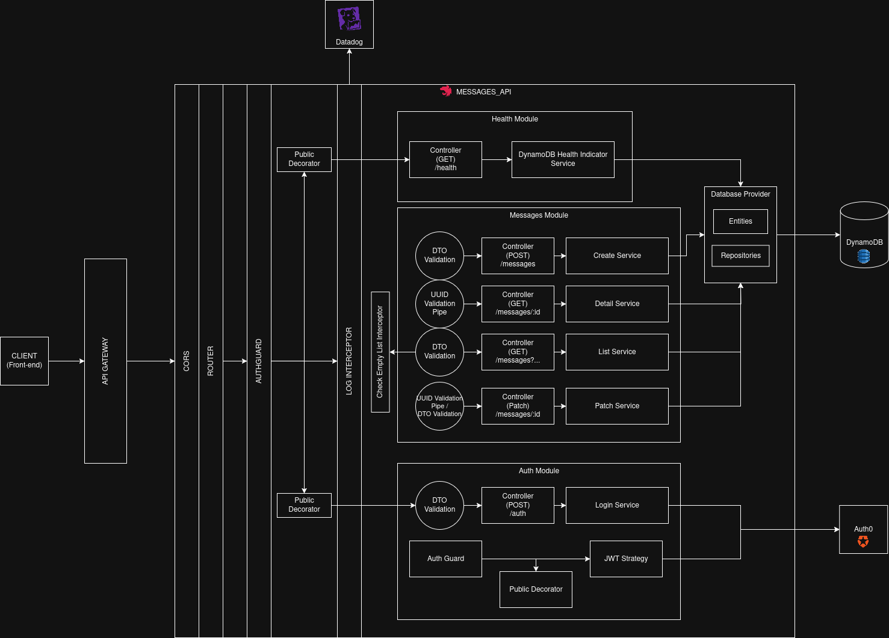

# 📩 Messages API


Uma API em **NestJS** para gerenciamento de mensagens, com persistência em **Amazon DynamoDB** (ou DynamoDB Local via Docker) e documentação interativa gerada pelo **Swagger**.

---

## ✨ Funcionalidades

- CRUD de mensagens
- Autenticação via Auth0
- Paginação cursor-based
- Health check e métricas
- Documentação automática (**Swagger UI**)
- Suporte a **CORS** restrito aos front-ends autorizados

---

## 🖥️ Pré-requisitos

| Ferramenta              | Versão mínima                                         |
| ----------------------- | ----------------------------------------------------- |
| Node.js                 | **22.11.0**                                           |
| npm                     | **10.9**                                              |
| Docker / Docker Compose | _Opcional_ — para executar o DynamoDB + Datadog Local |

---

## 🚀 Primeiros passos

### 1. Instalar dependências

```bash
npm install
```

### 2. (Opcional) Subir ambiente completo local (API + DynamoDB + Datadog Agent)

```bash
docker compose -f docker-compose.yml up -d --build
```

### 3. Criar tabela e popular com dados de exemplo

```bash
npm run create:dynamodb-table
npm run seed:messages
```

---

## 🏗️ Scripts NPM úteis

| Script       | Descrição                        |
| ------------ | -------------------------------- |
| `start`      | Inicia em **modo produção**      |
| `start:dev`  | _Hot-reload_ com **ts-node-dev** |
| `start:prod` | Build + execução em produção     |
| `test`       | Testes unitários (`jest`)        |
| `test:e2e`   | Testes end-to-end (`supertest`)  |
| `test:cov`   | Relatório de cobertura           |

---

## 🔌 Variáveis de ambiente (exemplo)

```env
PORT=3000
NODE_ENV=development
API_BASE_PATH=/api
CORS_ORIGINS=https://meu-frontend.com,https://outro-frontend.com

DB_REGION=sa-east-1
DB_ENDPOINT=http://localhost:8000
DB_ACCESS_KEY_ID=
DB_SECRET_ACCESS_KEY=

DD_API_KEY=
DD_SITE="datadoghq.com"

DD_APM_ENABLED=true
DD_APM_NON_LOCAL_TRAFFIC=true
DD_LOGS_ENABLED=true
DD_LOGS_CONFIG_CONTAINER_COLLECT_ALL=true
DD_SERVICE=messages-api
DD_ENV=dev
DD_VERSION=1.0.0
DD_TRACE_AGENT_HOSTNAME=dd-agent
DD_LOGS_INJECTION=true

AUTH0_AUDIENCE=
AUTH0_ISSUER_URL=
```

---

## 🛣️ Endpoints principais

| Método  | Rota                            | Descrição                |
| ------- | ------------------------------- | ------------------------ |
| `POST`  | `/auth`                         | Autentica o usuario      |
| `POST`  | `/messages`                     | Criar nova mensagem      |
| `GET`   | `/messages/:id`                 | Buscar por **ID**        |
| `GET`   | `/messages?sender=`             | Listar por **remetente** |
| `PATCH` | `/messages/:id/status`          | Atualizar **status**     |
| `GET`   | `/messages?startDate=&endDate=` | Listar por **período**   |

A documentação completa fica disponível em `/api/docs`.

---

## 🗄️ Modelagem de dados (DynamoDB)

### Esquema da tabela `Messages`

```text
PK  = sender (HASH)
SK  = sentAt (RANGE)

GSI #1: IdIndex
  - Partition key: id (HASH)

GSI #2: SentDateIndex
  - Partition key: sentMonth (HASH)
  - Sort key: sentAt (RANGE)
```

| Campo       | Tipo | Observações                                           |
| ----------- | ---- | ----------------------------------------------------- |
| `sender`    | S    | Remetente; principal critério de consulta             |
| `sentAt`    | N    | Epoch ms; permite ordenação cronológica               |
| `id`        | S    | UUID da mensagem; indexado em **IdIndex**             |
| `sentMonth` | S    | Ano-mês (`YYYY-MM`); particiona consultas por período |

#### Decisões de design

- **PK = `sender` + `sentAt`**  
  O caso de uso mais frequente é listar mensagens de um remetente em ordem temporal.  
  Ao combinar `sender` (HASH) e `sentAt` (RANGE) garantimos ordenação e ótima performance.

- **GSI 1 — `IdIndex`**  
  Busca direta por `id` (HASH only) para retornar rapidamente detalhes de uma mensagem específica, sem depender do remetente.

- **GSI 2 — `SentDateIndex`**  
  Para filtros por período, derivamos `sentMonth` (ex.: `2025-07`) e o usamos como HASH, mantendo `sentAt` como RANGE.  
  Dessa forma:
  1. As consultas de intervalo (`BETWEEN :from AND :to`) continuam eficientes.
  2. Evitamos hot partitions distribuindo itens por mês.

---

# 🔄 Fluxo da API



## 🔄 Fluxo da API — Visão Geral

O ciclo de vida de uma requisição na API segue uma cadeia de responsabilidades bem definida, garantindo **segurança**, **observabilidade**, **validação** e **acesso eficiente aos dados**. Abaixo está o detalhamento de cada etapa:

## 1. Client -> API Gateway

- A requisição se inicia no **client (frontend)**.
- Idealmente, ela passa por um **API Gateway**, que atua como ponto central de:
  - **Segurança** (por exemplo, rate limiting, autenticação básica);
  - **Observabilidade** (métricas e tracing);
  - **Roteamento externo**.

## 2. API Gateway -> Servidor da API

A requisição chega ao servidor da API e passa pelas seguintes camadas:

## 3. CORS Middleware

- A camada de CORS verifica se a origem da requisição (frontend) é **autorizada** a se comunicar com a API.
- Apenas domínios confiáveis são permitidos, reforçando a **segurança entre aplicações**.

## 4. Roteamento do NestJS

- O **roteador da API** identifica qual **módulo** e **controlador** deve processar a requisição com base na URL e método HTTP (GET, POST, etc.).

## 5. Guarda de Autenticação (AuthGuard)

- Antes de entrar na lógica de negócio, o `AuthGuard` verifica se a rota:
  - Está marcada como `@Public()` → o acesso é permitido sem autenticação;
  - Caso contrário → o guard **valida o token JWT** via **Auth0**, garantindo que apenas usuários autenticados possam continuar.

## 6. Interceptor de Logging

- Um **interceptor personalizado** coleta informações da requisição (método, caminho, duração, status HTTP, etc.).
- Esses logs são enviados para o **Datadog**, provendo **monitoramento e rastreamento centralizado**.

## 7. Pipes e DTOs de Validação

- Antes de chegar no controller, os dados são processados por:
  - **DTOs (Data Transfer Objects)** que tipam os dados esperados;
  - **Pipes de validação** que garantem que os dados estejam no formato correto e com os campos obrigatórios preenchidos.
- Isso previne erros e mantém a integridade dos dados que chegam ao sistema.

## 8. Controller → Service Layer

- O **Controller** orquestra a chamada para o **Service**, que contém a **lógica de negócio** da aplicação.
- Aqui são aplicadas regras de negócio específicas (ex: atualização de status, filtros de busca etc.).

## 9. Service → Repositório (Banco de Dados)

- A camada de serviço acessa o **provedor de banco de dados**, que encapsula a conexão com o **DynamoDB**.
- Esse repositório executa as operações de leitura, escrita ou atualização na base.

## 10. Interceptor de Lista Vazia

- Em endpoints de listagem, um **interceptor adicional** verifica se o resultado retornado está vazio.
- Caso esteja, a resposta é alterada para **HTTP 204 (No Content)**, seguindo boas práticas RESTful.

## 11. Health Check

- A API expõe um endpoint de **saúde** (`/health`), usado por ferramentas de monitoramento.
- Esse endpoint realiza uma **requisição ao banco de dados**, garantindo que o serviço está funcional e conectado ao DynamoDB.

---

## 📜 Licença

Distribuído sob a licença **MIT** — veja o arquivo [LICENSE](https://github.com/nestjs/nest/blob/master/LICENSE) para mais detalhes.
